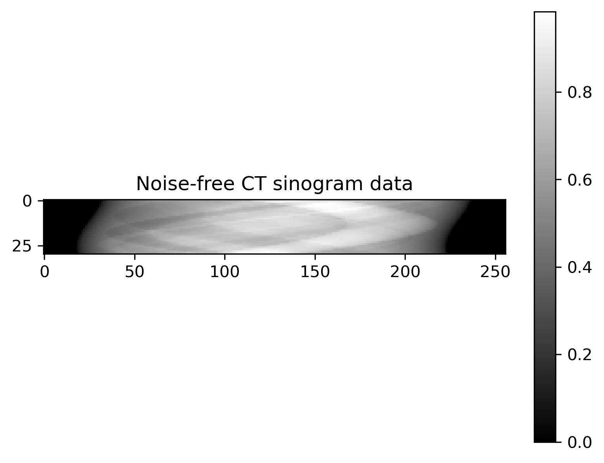
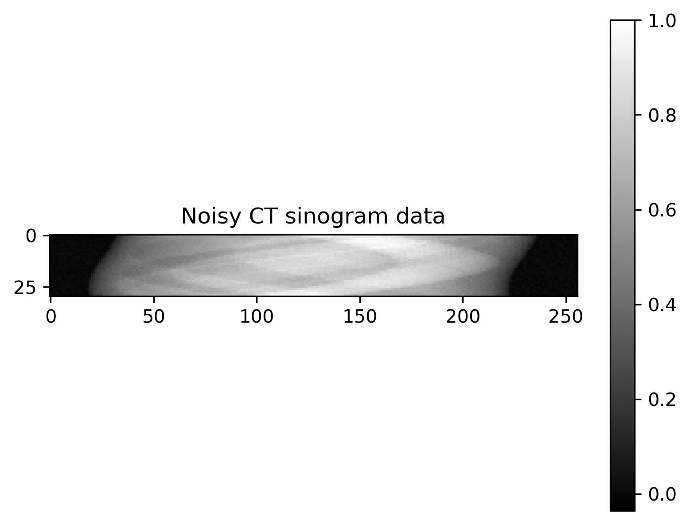
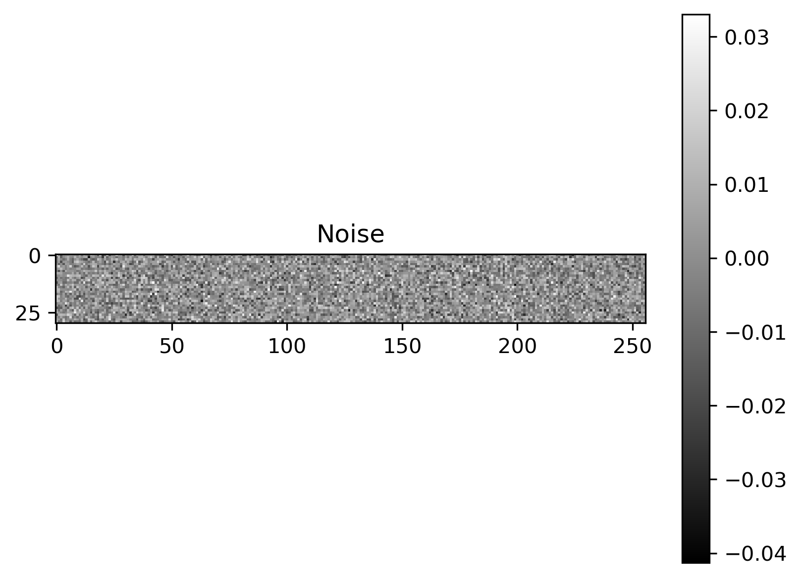
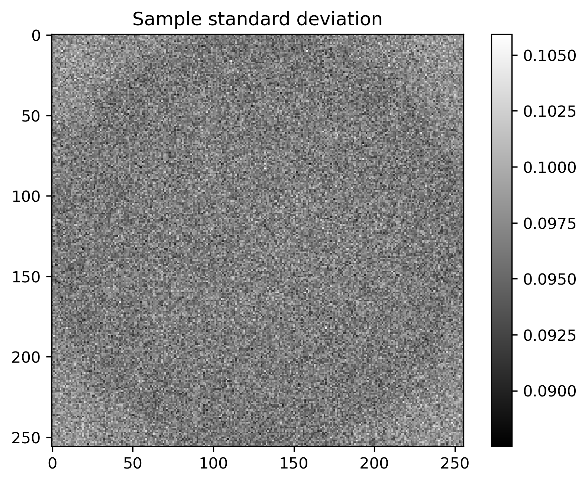
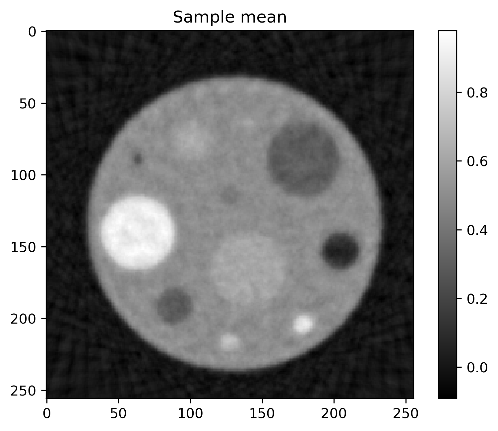
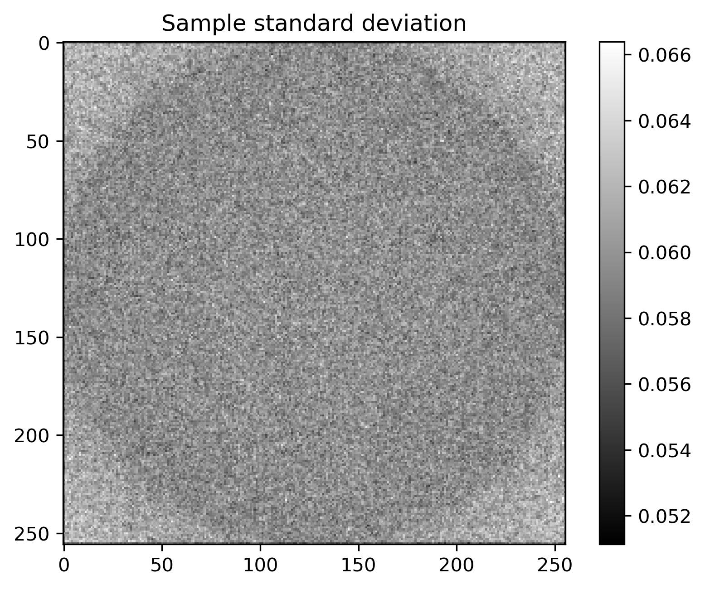
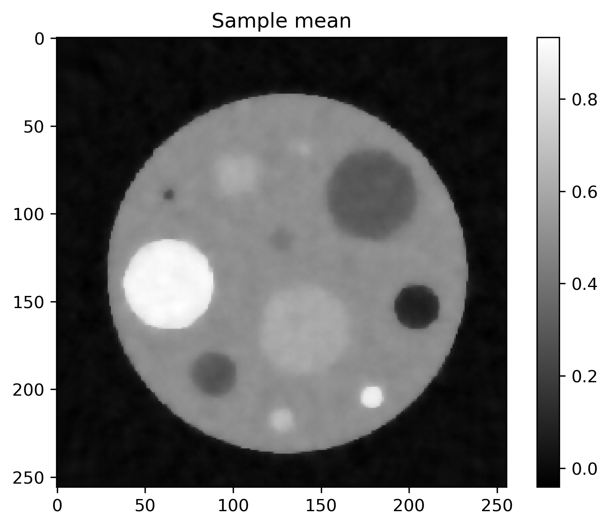
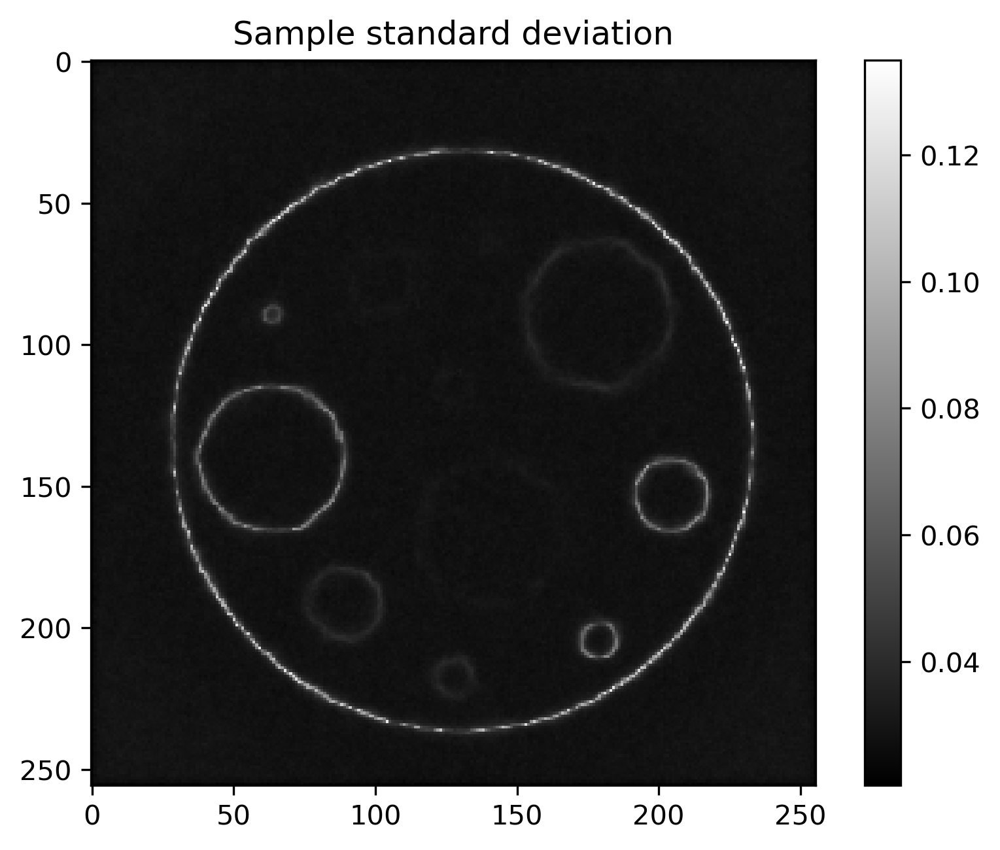

# Deconvolution1D

## Overview
This benchmark is based on a [1D Deconvolution test problem](https://cuqi-dtu.github.io/CUQIpy/api/_autosummary/cuqi.testproblem/cuqi.testproblem.Deconvolution1D.html) from the library [CUQIpy](https://cuqi-dtu.github.io/CUQIpy/). It defines a posterior distribution for a 1D deconvolution problem, with a Gaussian likelihood and four different choices of prior distributions with configurable parameters.

Plot of exact solution, noise-free data, noisy data and noise

pp |  00 
:-------------------------:|:-------------------------:|
 | 
 | 


Prior                      | Posterior mean             |  Posterior std
:-------------------------:|:-------------------------:|:-------------------------:
Gaussian  |   |  
GMRF  |   |  
LaplaceDiff  |   |  
#CauchyDiff  |   |  


Credibility interval plots of posterior samples using different priors


## Authors
- [Jakob S. Jørgensen](mailto:jakj@dtu.dk)
- [Nicolai A. B. Riis](mailto:nabr@dtu.dk)
- [Amal M. Alghamdi](mailto:amaal@dtu.dk)

## Run
```
docker run -it -p 4243:4243 linusseelinger/benchmark-deconvolution-1D
```

## Properties

Model | Description
---|---
CT_Gaussian | Posterior distribution with Gaussian prior
CT_GMRF | Posterior distribution with Gaussian Markov Random Field prior
CT_LMRF | Posterior distribution with Laplacian Markov Random Field prior
CT_CMRF | Posterior distribution with Cauchy Markov Random Field prior
CT_ExactSolution | Exact solution to the CT problem

### CT_Gaussian
Mapping | Dimensions | Description
---|---|---
input | [256**2] | Signal $\mathbf{x}$
output | [1] | Log PDF $\pi(\mathbf{b}\mid\mathbf{x})$ of posterior with Gaussian prior

Feature | Supported
---|---
Evaluate | True
Gradient | True
ApplyJacobian | False
ApplyHessian | False

Config | Type | Default | Description
---|---|---|---
delta | double | 0.01 | The prior parameter $\delta$ (see below).

### CT_GMRF
Mapping | Dimensions | Description
---|---|---
input | [256**2] | Signal $\mathbf{x}$
output | [1] | Log PDF $\pi(\mathbf{b}\mid\mathbf{x})$ of posterior with Gaussian Markov Random Field prior

Feature | Supported
---|---
Evaluate | True
Gradient | True
ApplyJacobian | False
ApplyHessian | False

Config | Type | Default | Description
---|---|---|---
delta | double | 0.01 | The prior parameter $\delta$ (see below).

### CT_LMRF
Mapping | Dimensions | Description
---|---|---
input | [256**2] | Signal $\mathbf{x}$
output | [1] | Log PDF $\pi(\mathbf{b}\mid\mathbf{x})$ of posterior Laplacian Markov Random Field prior

Feature | Supported
---|---
Evaluate | True
Gradient | False
ApplyJacobian | False
ApplyHessian | False

Config | Type | Default | Description
---|---|---|---
delta | double | 0.01 | The prior parameter $\delta$ (see below).

### CT_CMRF
Mapping | Dimensions | Description
---|---|---
input | [256**2] | Signal $\mathbf{x}$
output | [1] | Log PDF $\pi(\mathbf{b}\mid\mathbf{x})$ of posterior with Cauchy Markov Random Field prior

Feature | Supported
---|---
Evaluate | True
Gradient | True
ApplyJacobian | False
ApplyHessian | False

Config | Type | Default | Description
---|---|---|---
delta | double | 0.01 | The prior parameter $\delta$ (see below).

### CT_ExactSolution
Mapping | Dimensions | Description
---|---|---
input | [0] | No input to be provided. 
output | [256**2] | Returns the exact solution $\mathbf{x}$ for the deconvolution problem.

Feature | Supported
---|---
Evaluate | True
Gradient | False
ApplyJacobian | False
ApplyHessian | False

Config | Type | Default | Description
---|---|---|---
None | | |

## Mount directories
Mount directory | Purpose
---|---
None |

## Source code

[Sources here.](https://github.com/CUQI-DTU/CUQIpy/blob/main/cuqi/testproblem/_testproblem.py#L144)

## Description


The CT problem is defined by the inverse problem

$$
\mathbf{b} = \mathbf{A}\mathbf{x} + \mathbf{e},
$$

where $\mathbf{b}$ is an $m$-dimensional random vector representing the observed (vectorized) CT sinogram data, $\mathbf{A}$ is an $m\times n$ matrix representing the CT projection operator or "system matrix", $\mathbf{x}$ is an $n$-dimensional random vector representing the unknown (vectorized) square image, and $\mathbf{e}$ is an $m$-dimensional random vector representing the noise.

This benchmark defines a posterior distribution over $\mathbf{x}$ given $\mathbf{b}$ as

$$
\pi(\mathbf{x}\mid \mathbf{b}) \propto \pi(\mathbf{b}\mid \mathbf{x})\pi(\mathbf{x}),
$$

where $\pi(\mathbf{b}|\mathbf{x})$ is a likelihood function and $\pi(\mathbf{x})$ is a prior distribution. 

The noise is assumed to be Gaussian with a known noise level, and so the likelihood is defined via

$$
\mathbf{b} \mid \mathbf{x} \sim \mathcal{N}(\mathbf{A}\mathbf{x}, \sigma^2\mathbf{I}_m),
$$

where $\mathbf{I}_m$ is the $m\times m$ identity matrix and $\sigma=0.01$ defines the noise level.

The prior can be configured by choosing of the following assumptions about $\mathbf{x}$:

- `Gaussian`: Gaussian (Normal) distribution: $x_i \sim \mathcal{N}(0, \delta)$.

- `GMRF` Gaussian Markov Random Field: $x_i-x_{i-1} \sim \mathcal{N}(0, \delta)$.

- `CMRF` Cauchy Markov Random Field: $x_i-x_{i-1} \sim \mathcal{C}(0, \delta)$.

- `LMRF` Laplace Markov Random Field: $x_i-x_{i-1} \sim \mathcal{L}(0, \delta)$.

where $\mathcal{C}$ is the Cauchy distribution and $\mathcal{L}$ is the Laplace distribution. The parameter $\delta$ is the prior parameter and is configurable (see above).

The choice of prior is specified by providing the name to the HTTP model. In this case `CT_Gaussian`, `CT_GMRF`, `CT_LMRF`, and `CT_CMRF`, respectively. See [um-bridge Clients](https://um-bridge-benchmarks.readthedocs.io/en/docs/umbridge/clients.html) for more details.

In addition to the HTTP models for the posterior, there is also an HTTP model for the exact solution to the problem. This model is called `CT_ExactSolution` and returns exact phantom used to generate the synthetic data when called.

In CUQIpy the benchmark is defined and sampled as follows:

```python
import numpy as np
import cuqi

# Parameters
delta = 0.01
prior = "LMRF"

# Load data, define problem and sample posterior
TP = cuqi.testproblem.Deconvolution1D(
    dim=128,
    PSF="gauss",
    PSF_param=5,
    phantom="square",
    noise_std=0.01,
    noise_type="gaussian"
)
if prior == "Gaussian":
    TP.prior = cuqi.distribution.Gaussian(np.zeros(128), delta)
elif prior == "GMRF":
    TP.prior = cuqi.distribution.GMRF(np.zeros(128), 1/delta)
elif prior == "CMRF":
    TP.prior = cuqi.distribution.Cauchy_diff(np.zeros(128), delta)
elif prior == "LMRF":
    TP.prior = cuqi.distribution.Laplace_diff(np.zeros(128), delta)
TP.sample_posterior(2000).plot_ci(exact=TP.exactSolution)
```
